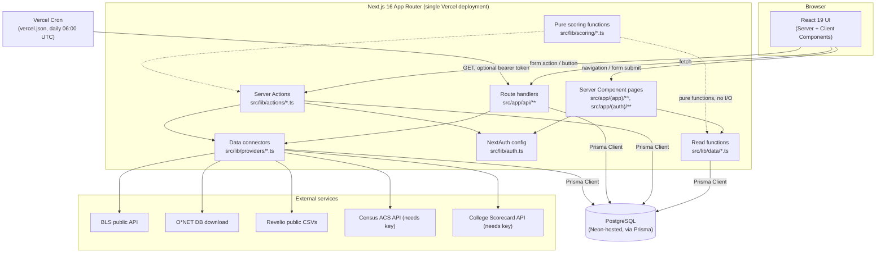

# ARCHITECTURE.md — Technical Architecture Reference

## System overview

CareerAtlas is a single Next.js 16 (App Router) application deployed as one
Vercel project. There is no separate backend service, no microservices, and
no message queue. All server-side logic — page rendering, data reads, form
mutations, the search API, CSV export, and the daily data-refresh job — runs
inside the same Next.js process (Vercel serverless/edge functions in
production, a single `node` process locally). The database is PostgreSQL,
accessed exclusively through Prisma. Authentication is self-hosted via
NextAuth (Credentials provider), not a third-party auth service.

## Frontend structure

- `src/app/layout.tsx` — root layout: Google fonts (`Geist`/`Geist Mono`),
  `ThemeProvider` (next-themes), `SessionProvider` (NextAuth session context,
  fetched server-side via `auth()` and passed down), `TooltipProvider`,
  `Toaster` (sonner).
- `src/app/page.tsx` — public landing page, a Server Component that queries
  `prisma.industry.count()` / `prisma.occupation.count()` /
  `prisma.careerTransition.count()` directly (the one place outside
  `src/lib/data/` that calls Prisma inline) to show live stats.
- `src/app/(app)/` — route group for the main authenticated-optional app
  shell. `layout.tsx` here renders `Sidebar` + `Topbar` + `DemoDataBanner` +
  `MobileNav` around every page in this group. Contains all the feature
  pages: dashboard, careers, salary, transitions, education, trends,
  compare, roles, saved, profile, settings, methodology, data-sources,
  admin/data-status, projection.
- `src/app/(auth)/` — route group for `/sign-in` and `/sign-up`, a minimal
  layout with no sidebar.
- `src/components/ui/` — shadcn/ui primitives (Radix-based).
- `src/components/layout/` — Sidebar, Topbar, MobileNav, global command-K
  search (`global-search.tsx`), `demo-data-banner.tsx`.
- `src/components/charts/` — Recharts wrapper components (bar, radar,
  distribution, trend).
- Most page-level interactivity (filters, selectors, forms) lives in
  colocated `*.tsx` client components inside each route's folder (e.g.
  `src/app/(app)/salary/salary-filters.tsx`), imported into the route's
  Server Component `page.tsx`.

## Backend structure

There is no separate backend — "backend" here means the server-only code
that runs inside the same Next.js app:

- `src/lib/data/*.ts` — read-only query functions, one file per feature area
  (`salary.ts`, `occupations.ts`, `transitions.ts`, `education.ts`,
  `trends.ts`, `dashboard.ts`, `compare.ts`, `geography.ts`, `industries.ts`,
  `projection.ts`, `saved.ts`, `admin.ts`). Called from Server Component
  `page.tsx` files.
- `src/lib/actions/*.ts` — Server Actions (`"use server"`), the only
  write path for user-initiated mutations: `auth.ts` (sign in/up),
  `account.ts` (delete account), `profile.ts` (upsert profile),
  `saved-occupations.ts` (toggle save), `comparisons.ts` (save/delete a
  comparison), `admin.ts` (`triggerDataImport`).
- `src/app/api/*/route.ts` — plain route handlers for things that aren't
  page renders or form actions: `search` (GET, JSON), `export/saved` (GET,
  CSV download), `cron/update-trends` (GET, triggers all configured
  connectors), `auth/[...nextauth]` (NextAuth's own handler, all methods).
- `src/lib/providers/*.ts` — the `DataProvider` connector implementations
  plus `registry.ts` (the list of active connectors) and `run-import.ts`
  (`runDataImport`/`runAllConfiguredImports`, the orchestration layer that
  logs every run to `DataImportRun`/`DataQualityCheck`).
- `src/lib/scoring/*.ts` — pure functions with no I/O, imported by both
  `prisma/seed.ts` (to generate consistent simulated data) and by
  `src/lib/data/*` / page components (to compute the same figures live for
  user-adjustable inputs like the projection calculator).
- `src/lib/auth.ts` / `src/lib/prisma.ts` — the two cross-cutting
  singletons (NextAuth config, Prisma client).

## Request lifecycle (a representative example: viewing `/roles/[role]`)

1. Browser navigates to `/roles/software-engineer`.
2. Next.js matches `src/app/(app)/roles/[role]/page.tsx`, a Server
   Component. The `(app)/layout.tsx` wraps it with Sidebar/Topbar/Banner.
3. The page component calls functions in `src/lib/data/occupations.ts` (and
   related data files) to fetch the occupation, its salary
   percentiles/history/forecasts, skills, education requirements, etc., via
   Prisma — one or more `await prisma.*.findUnique/findMany(...)` calls,
   run server-side, never exposed to the client as raw queries.
4. `auth()` may also be called (e.g. to check `isOccupationSaved`) — this
   reads the NextAuth JWT from the request's cookies.
5. The page renders server-side (React Server Components), streaming HTML
   plus any client components (e.g. `role-salary-section.tsx` for the
   seniority-level selector, `save-career-button.tsx`) that hydrate in the
   browser.
6. User interactions on client components either call a Server Action
   directly (e.g. clicking "Save career" calls
   `toggleSavedOccupation` from `src/lib/actions/saved-occupations.ts`) or
   trigger a client-side `fetch` to a route handler (e.g. the global search
   box calls `GET /api/search`).
7. A Server Action mutation ends with `revalidatePath(...)` so the next
   render of affected pages reflects the change without a full reload.

## Data flow

`prisma/seed.ts` is the origin of nearly all data in a fresh install:
deterministic RNG (`src/lib/seed-data/rng.ts`, seeded per-entity via
`rngSeeded(...)`) combined with static reference data in
`src/lib/seed-data/*.ts` (industries, taxonomy, geography, skills,
education, methodology, data sources) produces the full simulated dataset,
run once via `npm run db:seed`. From then on:
- **Reads**: `src/lib/data/*` → Prisma → Postgres → rendered into Server
  Components.
- **User writes**: browser → Server Action → Prisma → Postgres →
  `revalidatePath`.
- **External-data writes**: Vercel Cron (or the admin "Run now" button) →
  `/api/cron/update-trends` or `triggerDataImport` → `runDataImport` →
  provider's `fetchData → normalizeData → validateData → upsertData` →
  Prisma → Postgres, with every run logged to `DataImportRun`/
  `DataQualityCheck` and the parent `DataSource.status` updated.

## Authentication flow

1. `/sign-up` (`src/app/(auth)/sign-up/page.tsx`) submits to
   `signUpAction` (`src/lib/actions/auth.ts`): Zod-validates
   name/email/password, checks for an existing user by lowercased email,
   hashes the password with `bcrypt.hash(password, 10)`, creates the `User`
   row, then calls NextAuth's `signIn("credentials", ...)` to establish a
   session and redirect to `/dashboard`.
2. `/sign-in` submits to `signInAction`, which Zod-validates and calls
   `signIn("credentials", ...)`; on `AuthError` it returns a generic
   "Invalid email or password" message (no user enumeration).
3. `src/lib/auth.ts`'s `Credentials.authorize` looks up the user by
   lowercased email, compares the submitted password against
   `user.passwordHash` with `bcrypt.compare`, and returns
   `{ id, email, name }` on success or `null` on failure.
4. Session strategy is `jwt` (not database-session), with `trustHost: true`
   (required for Vercel/self-hosted deployments where Auth.js can't infer
   the host). The `jwt` callback stashes `user.id` on the token; the
   `session` callback copies it back onto `session.user.id` so server code
   can read `session.user.id` directly.
5. `SessionProvider` (`src/components/session-provider.tsx`) wraps the app
   with NextAuth's client-side session context, seeded from the
   server-fetched session in `src/app/layout.tsx` to avoid a client-side
   refetch/flash.

## Authorization flow

There is **no centralized authorization layer** — no `middleware.ts`, no
route-group-level gate. Each page/action that cares about identity calls
`auth()` (or, in the case of Server Actions, is called from client
components that assume identity) and branches:
- Pages that show personalized content when signed in and a generic/empty
  state otherwise: `/dashboard`, `/saved`.
- Pages/actions that hard-require a session and return an error object if
  absent: `/profile` (`upsertProfile`), `/settings`
  (`deleteAccountAction`), `toggleSavedOccupation`, `saveComparison`,
  `deleteSavedComparison`, `GET /api/export/saved`.
- **`/admin/data-status` and `triggerDataImport`: no `auth()` call at all.**
  Anyone who can reach the URL/action can view every connector's status and
  trigger a live data-import run. This is the most significant gap found in
  this audit — see `SECURITY.md`.
- No role/permission model exists in the schema (no `role` field on `User`).
  "Admin" is purely a route name, not an enforced concept.

## Database access flow

All database access goes through the single Prisma client singleton in
`src/lib/prisma.ts` (`globalForPrisma` pattern to avoid re-instantiating the
client on every hot-reload in dev). No raw SQL, no second ORM, no direct
`pg` usage found anywhere in `src/`. Query shape follows Prisma's
relation-include style (see `src/lib/data/admin.ts`'s
`listDataSourceStatus` for a representative example: `findMany` with nested
`include` for the 5 most recent import runs and their quality checks).

## Storage flow

No file/object storage (no S3/Supabase Storage/Vercel Blob usage found).
`public/` contains only the five default Next.js placeholder SVGs
(`file.svg`, `vercel.svg`, `next.svg`, `globe.svg`, `window.svg`) — no
product-specific static assets, no user-uploaded content, and no upload
endpoint exists anywhere in the codebase.

## External API / integration flow

See "API and integrations" in `CLAUDE.md` and the full breakdown in
`API_REFERENCE.md`. In summary: six `DataProvider` implementations under
`src/lib/providers/`, each independently `fetchData → normalizeData →
validateData → upsertData`, orchestrated by `runDataImport`/
`runAllConfiguredImports` (`src/lib/providers/run-import.ts`), triggered
either by the daily Vercel Cron hit to `/api/cron/update-trends` or manually
via the (currently unauthenticated) admin page's "Run now" button per
source.

## Real-time / background / scheduled jobs

- **Scheduled**: `vercel.json` configures a single Vercel Cron job —
  `GET /api/cron/update-trends`, daily at `0 6 * * *` (06:00 UTC). No other
  scheduled jobs exist.
- **Background**: none — no queues, no `setTimeout`-based workers, no
  Inngest/Trigger.dev/etc. integration.
- **Real-time**: none — no WebSockets, no Server-Sent Events, no polling
  found. All UI updates are either full page navigations, React Server
  Component re-renders after `revalidatePath`, or ordinary client-side
  `useState`/`fetch`.

## Caching

Relies entirely on Next.js's built-in App Router caching/revalidation model:
Server Actions call `revalidatePath(...)` after a mutation to invalidate the
relevant route's cache (e.g. `saved-occupations.ts` revalidates `/saved` and
the specific `/roles/[slug]`). No explicit `fetch` cache configuration, no
`unstable_cache`, no external cache layer (no Redis/Upstash), and no
`revalidate`/`dynamic` export was found on the pages read during this audit
— meaning their caching behavior follows Next.js 16's defaults, which this
audit did not exhaustively verify against every route (see the `npm run
build` caveat in `PROJECT_STATE.md`).

## Error handling

No custom `error.tsx`/`global-error.tsx`/`not-found.tsx` files were found
under `src/app/` during this audit (not confirmed exhaustively — see
`FILE_MAP.md`/`UI_SYSTEM.md` for what was checked). Server Actions return
typed `{ error: string }` / `{ success: true }`-style result objects rather
than throwing for expected failure cases (e.g. "not_signed_in", "not_found",
"An account with that email already exists."); client components branch on
these and show inline messages or `sonner` toasts (e.g.
`run-import-button.tsx` calling `toast.error`/`toast.success`). Provider
connectors catch their own errors inside `runProvider` (`src/lib/providers/types.ts`)
and convert them into a structured `ImportReport` rather than letting an
unhandled rejection reach the caller.

## Logging

No structured logging, no external logging/observability service
integration (no Sentry/Datadog/etc. found). Prisma's own client logging is
configured in `src/lib/prisma.ts`: `["error", "warn"]` in development,
`["error"]` only in production — this is Prisma's internal query-error
logging, not application-level logging. No `console.log` calls exist
anywhere in `src/` (verified by repo-wide grep this audit).

## Deployment architecture

Single Vercel project, inferred from `.vercel/` (local Vercel CLI link
metadata) and `vercel.json` (Cron config) — no other hosting configuration
found in the repo. Standard Next.js-on-Vercel model: Vercel builds and
serves the app, database is external (Neon Postgres, based on the
`DATABASE_URL` host observed in this working copy's `.env`). Full detail:
`DEPLOYMENT.md`.

## Security boundaries

- Browser ↔ server boundary: enforced by Next.js's Server Component /
  Server Action / route-handler split — no client-side code can reach
  Prisma or `process.env` server secrets directly (verified: no `"use
  client"` file imports `@/lib/prisma` or reads `process.env.DATABASE_URL`-
  style server secrets during this audit).
- Session boundary: NextAuth JWT cookie, `trustHost: true`.
- **Gap**: no boundary at all around `/admin/data-status` — see
  "Authorization flow" above and `SECURITY.md`.
- API keys for external connectors (`BLS_API_KEY`, `CENSUS_API_KEY`,
  `COLLEGE_SCORECARD_API_KEY`) are read server-side only, inside
  `src/lib/providers/*.ts`, never sent to the client.

## Major architectural risks

1. **No centralized auth/authorization gate** — every new page must
   remember to call `auth()` itself; the admin page is proof this can be
   forgotten. A `middleware.ts` (or at minimum a shared `requireAuth()`
   helper used consistently) would close this class of bug.
2. **Unauthenticated external-API triggers** — `/admin/data-status`'s "Run
   now" buttons and the cron endpoint (when `CRON_SECRET` is unset) let
   anyone on the internet cause the app to make outbound calls to BLS,
   O*NET, and Revelio. Low severity (no cost, no destructive effect beyond
   possible rate-limiting), but still an open door.
3. **Static-generation vs. live-database risk at build time** — several
   Server Components query the database directly with no visible
   `dynamic`/`revalidate` override; depending on Next.js 16's actual
   inference, `next build` could either statically bake in landing-page
   counts (stale after reseeding) or, per this audit's caution, attempt to
   reach the real database during CI/build. Worth explicitly deciding and
   documenting per-route caching behavior.
4. **Single global Prisma client, no read replica / pooling config visible
   in code** — `DATABASE_URL` is expected to already be a pooled connection
   string in production (README recommends Supabase's "Transaction pooler"
   for serverless); if a future deploy uses a non-pooled URL, serverless
   function cold starts could exhaust Postgres connections.
5. **Deterministic seed coupling** — `prisma/seed.ts` is tightly coupled to
   the exact shape/order of `src/lib/seed-data/*.ts` and the scoring
   functions it imports; a schema or scoring-function change that isn't
   mirrored in the seed script will make `npm run db:seed` fail or (worse)
   silently produce different data than before.
