# DATABASE.md — Storage Model

## Provider

PostgreSQL, accessed via Prisma (`@prisma/client@6.19.3`). In this working
copy, `DATABASE_URL` (`.env`/`.env.local`) points at a **Neon-hosted**
Postgres instance (host contains `neon.tech`) using the pooled connection
(`-pooler` in the hostname, `channel_binding=require&sslmode=require`).
`README.md` documents Supabase, Neon, or Vercel Postgres as equally
supported options. The schema is deliberately written to also run unchanged
on **SQLite** (flip `datasource.provider` to `"sqlite"`, point
`DATABASE_URL` at a local file) for disconnected local development — see
`DECISIONS.md` DEC-001 for why.

## Schema location

`/Users/gariyuu/Projects/careeratlas/prisma/schema.prisma` — 37 models, ~920
lines, organized under 7 comment-delimited sections: Taxonomy, Geography,
Compensation, Labor market, Education, Career transitions, Data governance,
Users.

## Migrations

One migration exists:
`prisma/migrations/20260727202821_init/migration.sql` (the full initial
schema, generated 2026-07-27). `prisma/migrations/migration_lock.toml` pins
the provider to `postgresql`. No migration has been added since the initial
one — all 6 connector-adding commits and the favicon commit made no schema
changes (confirmed: `EconomicIndicator`, `DataSource`, `DataImportRun`,
`DataQualityCheck` — the tables the connectors write to — already existed in
the initial migration).

## Seeds

`prisma/seed.ts` (956 lines), run via `npm run db:seed`
(`prisma.seed` config in `package.json` points at it via `tsx`). Fully
deterministic (seeded RNG, see `DECISIONS.md` DEC-003) — same output every
run against an empty database. `npm run db:reset` runs
`prisma migrate reset --force` (drops and recreates the schema) then
auto-reseeds via Prisma's seed hook.

## Tables (models), fields, relationships

### Taxonomy: Industry → Subindustry → JobFamily → Occupation → Seniority

- **`Industry`** — `slug` (unique), `name`, `description`, `icon`. Has many
  `Subindustry`, `IndustryMomentumScore`, `IndustryStatistic`,
  `LayoffStatistic`, `RemoteWorkStatistic`.
- **`Subindustry`** — belongs to `Industry` (cascade delete). Has many
  `JobFamily`.
- **`JobFamily`** — belongs to `Subindustry` (cascade delete). Has many
  `Occupation`.
- **`SeniorityLevel`** — `slug` (unique), `rank` (0=Intern .. 13=C-Suite/
  Partner, used for ordering and salary projections), `name`, `description`.
- **`Occupation`** — the standardized "role" entity. `slug` (unique),
  `title`, `summary`, `responsibilities` (JSON string array),
  `automationExposure` (0-1), `remoteFriendliness` (0-1), `onetSocCode`
  (nullable, populated by the O*NET connector). Belongs to `JobFamily`
  (cascade delete). Has many: `OccupationAlias`, `OccupationSeniority`,
  `OccupationSkill`, `OccupationCertification`, `SalaryObservation`,
  `SalaryPercentile`, `SalaryHistory`, `SalaryForecast`,
  `EmploymentStatistic`, `JobPostingStatistic`,
  `OccupationEducationRequirement`, `CareerTransition` (both directions, via
  named relations `TransitionFrom`/`TransitionTo`), `SavedOccupation`,
  `SalaryScenario`, `CareerGoal`, `EducationOutcome`.
- **`OccupationSeniority`** — join table, `@@unique([occupationId,
  seniorityLevelId])`, carries `yearsExperienceMin`/`Max`.
- **`OccupationAlias`** — alternate titles/abbreviations/misspellings,
  indexed on `alias` for search.
- **`Skill`** — `slug` (unique), `category`. Has many `OccupationSkill`,
  `SkillDemandStatistic`, `TransitionSkillGap`, `UserSkill`,
  `LearningPlanItem`.
- **`OccupationSkill`** — join, `@@unique([occupationId, skillId])`,
  `importance` (0-1), `isCore`.
- **`Certification`** / **`OccupationCertification`** — similar join
  pattern, `frequency` (0-1 share of postings requesting it).

### Geography

- **`Country`** — `code` (unique, ISO 3166-1 alpha-2), `currencyCode`,
  `supportLevel` (`"full" | "partial" | "seed"`). Has many `Region`,
  `CostOfLivingIndex`, `SalaryObservation`, `EmploymentStatistic`,
  `Institution`.
- **`Region`** — belongs to `Country`, `@@unique([countryId, code])`.
- **`MetroArea`** — belongs to `Region`, `slug` (unique).
- **`CostOfLivingIndex`** — scoped to a `Country` and optionally a
  `MetroArea`; `index` (100 = US national average baseline).

### Compensation

- **`SalaryObservation`** — raw observation-level rows: `seniorityRank`
  (denormalized `int`, not a relation, for fast filtering),
  `workArrangement`/`companySize`/`employmentType` (plain strings),
  `baseSalary`/`bonus`/`equity`/`commission`/`totalComp`, `sampleSize`,
  `confidence`, `dataStatus`, optional `sourceId` → `DataSource`.
- **`SalaryPercentile`** — pre-aggregated `p10`/`p25`/`median`/`p75`/`p90`/
  `mean` per occupation × country × seniority rank.
- **`SalaryHistory`** — one row per occupation × country × year,
  `@@unique([occupationId, countryId, year])`, `yoyChangePct`.
- **`SalaryForecast`** — occupation × country × `yearsOut` (1/3/5/10) ×
  `scenario` (conservative/expected/aggressive), `projectedTotalComp`,
  optional `methodologyVersionId`.

### Labor market

- **`EmploymentStatistic`** — occupation × country × year,
  `@@unique([occupationId, countryId, year])`, `employedCount`,
  `projectedGrowthPct`, `openingsPerYear`.
- **`JobPostingStatistic`** — per-occupation posting activity snapshot.
- **`IndustryStatistic`** — per-industry × year, `@@unique([industryId,
  year])`, revenue/profit/employment growth percentages.
- **`LayoffStatistic`**, **`RemoteWorkStatistic`** — per-industry snapshots.
- **`SkillDemandStatistic`** — per-skill demand growth/posting-share/
  trend-direction snapshot.
- **`IndustryMomentumScore`** — the Job Market Momentum Score: composite
  `score` plus 9 stored sub-scores (employmentGrowth, postingGrowth,
  salaryGrowth, hiringVelocity, layoffRisk [inverted — higher = safer],
  skillDemand, automationSafety [higher = less exposed],
  entryLevel, geographicDiversity), plus a `weights` JSON string
  (`Record<factor, number>`) so the UI can recompute with custom weights
  client-side without a round trip. 4 trailing quarterly snapshots seeded
  per industry, indexed `@@index([industryId, observedAt])`.

### Education

- **`Institution`** — `slug` (unique), belongs to `Country`, `control`
  (public/private_nonprofit/private_forprofit), `levelType`
  (two_year/four_year/bootcamp/trade_school), tuition fields.
- **`Major`** — `slug` (unique), `category` (STEM/Business/Social
  Science/Humanities/Health/General).
- **`EducationProgram`** — join of `Institution` × `Major` × `degreeLevel`,
  `@@unique([institutionId, majorId, degreeLevel])`.
- **`EducationOutcome`** — the ROI data: `entrySalaryMedian`,
  `salaryPremiumPct`, `timeToFirstRoleMonths`, `employmentRatePct`,
  `tenYearReturnPct`, `twentyYearReturnPct`, `sampleSize`, `confidence`,
  `dataStatus`. Optionally scoped to an `EducationProgram` and/or
  `Occupation`.
- **`OccupationEducationRequirement`** — per-occupation × degreeLevel,
  `requiresPct`/`prefersPct` (0-1 share of postings).
- **`CollegeCost`** — per-institution × degreeLevel, `totalCost`, `years`.
- **`EducationRoiScenario`** — **user-scoped** (`userId` nullable), a
  persisted custom ROI scenario. Schema exists but this audit found no
  Server Action or page that writes to this table — the interactive
  education-compare tool (`education-compare-tool.tsx`) computes ROI
  client-side via `computeEducationRoi()` without persisting scenarios.
  **Likely dead/future-facing schema** — flagged, not removed.

### Career transitions

- **`CareerTransition`** — `fromOccupationId`/`toOccupationId`
  (both → `Occupation`, named relations `TransitionFrom`/`TransitionTo`),
  `@@unique([fromOccupationId, toOccupationId])`. `category` (adjacent /
  ambitious / lower_risk / highest_paying / minimal_retraining /
  strongest_demand), `salaryDeltaPct`, `transitionDifficulty` (0-100),
  `opportunityScore`/`demandScore`/`confidenceScore`/`compatibilityScore`
  (all 0-100), `typicalTransitionMonths`, `educationCommonlyRequired` (JSON
  string array), `postingCoOccurrence` (0-1).
- **`TransitionSkillGap`** — per-transition × skill, `gapType`
  (missing/recommended/transferable), `postingFrequency`, `salaryValue`,
  `demandGrowth` (all 0-1), `monthsToLearn`.

### Data governance

- **`DataSource`** — `slug` (unique), `name`, `organization`, `url`,
  `requiresApiKey`, `apiKeyEnvVar`, `status`
  (`active`/`degraded`/`not_configured`/`error`, default
  `not_configured`), `description`. Referred to by `sourceId` foreign keys
  from nearly every data-bearing table above.
- **`EconomicIndicator`** — scalar economy-wide indicators (e.g. US average
  hourly earnings level/YoY growth, ACS median-earnings-by-education
  reference figures), `slug` (unique), `value`, `unit`
  (`pct`/`usd`/`index`).
- **`DataImportRun`** — one row per connector execution: `status`
  (running/success/partial/failed), `rowsImported`, `rowsRejected`,
  `warnings` (JSON string array), `errorMessage`.
- **`DataQualityCheck`** — per-import-run check results (`checkName`,
  `passed`, `detail`). Currently only one check is written
  (`rows_imported_gt_zero`, see `run-import.ts`).
- **`MethodologyVersion`** — human-readable formula/weights descriptions per
  score, rendered on `/methodology`, `@@unique([scoreName, version])`.

### Users

- **`User`** — `email` (unique), `name`, `emailVerified` (nullable — no
  code path was found that sets this; see `DECISIONS.md` DEC-004),
  `passwordHash` (nullable — nullable to support the `PrismaAdapter`'s
  OAuth-account-linking shape even though only Credentials is used today),
  `image`. Has many: `Account`, `Session`, `SavedOccupation`,
  `SavedComparison`, `SalaryScenario`, `CareerGoal`, `UserSkill`,
  `LearningPlan`, `EducationRoiScenario`; has one `UserProfile`.
- **`Account`** / **`Session`** — standard NextAuth/`@auth/prisma-adapter`
  shape.
- **`UserProfile`** — 1:1 with `User` (`@unique` on `userId`), the
  personalization data used by the Dashboard: `educationStatus`,
  `currentIndustry`, `currentRoleSlug`, `location`,
  `expectedGraduationYear`, `skillsCsv`, `salaryGoal`,
  `workArrangementPref`, `currentSalary`, `yearsExperience`, `degreeLevel`,
  `major`, `companySize`, `onboardedAt`.
- **`SavedOccupation`** — `@@unique([userId, occupationId])`, optional
  `note`.
- **`SavedComparison`** — `userId` **nullable** (schema supports anonymous
  saved/shared comparisons via `slug`, though the current Server Action
  requires a session — see `FEATURES.md`), `occupationIds` (JSON string
  array, max 5 by convention, not DB-enforced).
- **`SalaryScenario`** — a saved what-if projection input set
  (currentSalary, yearsExperience, annualRaisePct, promotionEveryYears,
  inflationPct, jobChangeProbabilityPct, locationMultiplier, degreeLevel).
  Like `EducationRoiScenario`, this audit found no Server Action that
  writes to this table — the live `/projection` page computes and displays
  results without persisting them. **Likely dead/future-facing schema.**
- **`CareerGoal`** — target salary/year/occupation + note.
- **`UserSkill`** — `level` (learning/proficient/expert, default
  "learning").
- **`LearningPlan`** / **`LearningPlanItem`** — a plan (optionally targeting
  an occupation slug) with skill checklist items (`done` boolean). No
  Server Action or page for creating/editing a `LearningPlan` was found
  during this audit — **schema exists, feature UI does not appear to.**
  Flagged as "Backend only / schema only," not confirmed dead without a
  deeper full-repo grep beyond this audit's scope.

## Indexes and constraints (notable ones)

Nearly every foreign-key column has a `@@index`; several tables have
composite `@@unique` constraints enforcing one-row-per-entity-combination
(`OccupationSeniority`, `OccupationSkill`, `OccupationCertification`,
`SalaryHistory`, `EmploymentStatistic`, `IndustryStatistic`,
`CareerTransition`, `TransitionSkillGap`, `EducationProgram`,
`SavedOccupation`, `UserSkill`, `LearningPlanItem`,
`MethodologyVersion`). All primary keys are `cuid()` strings, not
auto-increment integers.

## Ownership / deletion rules

Cascade-delete (`onDelete: Cascade`) is used consistently for
parent→child ownership: deleting a `User` cascades to `Account`, `Session`,
`UserProfile`, `SavedOccupation`, `SalaryScenario`, `CareerGoal`,
`UserSkill`, `LearningPlan` (→ `LearningPlanItem`), `EducationRoiScenario`,
and `SavedComparison`. Deleting an `Occupation` cascades to all its
salary/employment/education-requirement/transition/saved rows. This is what
makes `deleteAccountAction`'s single `prisma.user.delete(...)` call
sufficient to fully remove a user's data (verified: no orphaned-row risk
found in the schema for user-owned tables).

## Storage buckets

None — no file/object storage integration exists in this repo (confirmed:
no S3/Supabase Storage/Vercel Blob SDK in `package.json`).

## RLS policies

**None** — this is a plain Prisma/Postgres setup with no Row-Level Security
policies (RLS is a Postgres/Supabase-specific feature; nothing in
`prisma/migrations/20260727202821_init/migration.sql` sets up RLS, and
Prisma itself has no RLS concept). All authorization happens in application
code (Server Actions checking `session.user.id`), not at the database
layer. See `SECURITY.md` for the implications.

## Sensitive data

- `User.passwordHash` — bcrypt-hashed (cost factor 10, per
  `bcrypt.hash(password, 10)` in `src/lib/actions/auth.ts`), never the
  plaintext password. Never selected/returned to the client in any
  `src/lib/data/*` function read during this audit.
- `Account.refresh_token`/`access_token`/`id_token` — present in the schema
  for OAuth-provider compatibility but unused (only Credentials provider is
  configured); no OAuth tokens are ever actually stored today.
- `DATABASE_URL` itself (in `.env`/`.env.local`) contains live database
  credentials — never printed in full anywhere in this documentation set.

## Migration risks

- The single existing migration is the entire schema at once — there's no
  precedent in this repo yet for an *incremental* migration, so the first
  real schema change will be the first test of the migration workflow in
  practice.
- `prisma migrate reset --force` (`npm run db:reset`) is fully destructive —
  drops and recreates the schema, then reseeds. Never run against a
  non-disposable database.
- Because enum-like fields are plain strings (DEC-001), a schema migration
  can't lean on Postgres to catch a typo'd status value — only application
  code and tests (limited, per `TESTING.md`) can.
- The SQLite-portability constraint (DEC-001) means any future schema change
  should avoid Postgres-only column types/features if that portability is
  meant to be preserved.

## Entity relationship diagram

```mermaid
erDiagram
    Industry ||--o{ Subindustry : has
    Subindustry ||--o{ JobFamily : has
    JobFamily ||--o{ Occupation : has
    Occupation ||--o{ OccupationSeniority : has
    SeniorityLevel ||--o{ OccupationSeniority : has
    Occupation ||--o{ OccupationAlias : has
    Occupation ||--o{ OccupationSkill : has
    Skill ||--o{ OccupationSkill : has
    Occupation ||--o{ OccupationCertification : has
    Certification ||--o{ OccupationCertification : has

    Country ||--o{ Region : has
    Region ||--o{ MetroArea : has
    Country ||--o{ CostOfLivingIndex : has
    MetroArea ||--o{ CostOfLivingIndex : has

    Occupation ||--o{ SalaryObservation : has
    Occupation ||--o{ SalaryPercentile : has
    Occupation ||--o{ SalaryHistory : has
    Occupation ||--o{ SalaryForecast : has
    Occupation ||--o{ EmploymentStatistic : has
    Occupation ||--o{ JobPostingStatistic : has
    Occupation ||--o{ OccupationEducationRequirement : has

    Industry ||--o{ IndustryStatistic : has
    Industry ||--o{ LayoffStatistic : has
    Industry ||--o{ RemoteWorkStatistic : has
    Industry ||--o{ IndustryMomentumScore : has
    Skill ||--o{ SkillDemandStatistic : has

    Institution ||--o{ EducationProgram : has
    Major ||--o{ EducationProgram : has
    Major ||--o{ EducationOutcome : has
    Institution ||--o{ CollegeCost : has
    EducationProgram ||--o{ EducationOutcome : has
    Occupation ||--o{ EducationOutcome : has

    Occupation ||--o{ CareerTransition : "fromOccupation"
    Occupation ||--o{ CareerTransition : "toOccupation"
    CareerTransition ||--o{ TransitionSkillGap : has
    Skill ||--o{ TransitionSkillGap : has

    DataSource ||--o{ DataImportRun : has
    DataImportRun ||--o{ DataQualityCheck : has
    DataSource ||--o{ EconomicIndicator : sources
    MethodologyVersion ||--o{ SalaryForecast : versions

    User ||--o{ Account : has
    User ||--o{ Session : has
    User ||--|| UserProfile : has
    User ||--o{ SavedOccupation : saves
    Occupation ||--o{ SavedOccupation : "saved by"
    User ||--o{ SavedComparison : saves
    User ||--o{ SalaryScenario : has
    Occupation ||--o{ SalaryScenario : "used in"
    User ||--o{ CareerGoal : has
    User ||--o{ UserSkill : has
    Skill ||--o{ UserSkill : "held by"
    User ||--o{ LearningPlan : has
    LearningPlan ||--o{ LearningPlanItem : has
    Skill ||--o{ LearningPlanItem : "targeted by"
    User ||--o{ EducationRoiScenario : has
```

